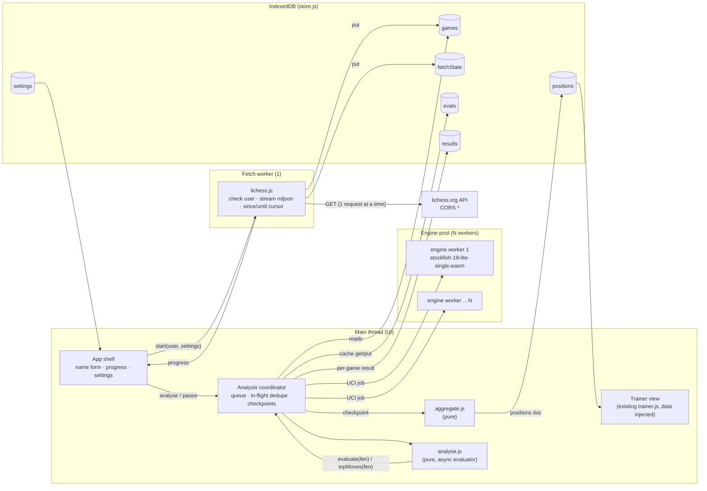

# Opening trainer in the browser (Option C)

## 1. Goal and non-goals

**Goal.** A fully static website on GitHub Pages that a non-technical friend opens, types a Lichess name into, and gets the same training set that `uv run trainer update` produces today. Downloading, Stockfish analysis and the quiz all run in the visitor's browser. There is no backend and no hosting cost.

**Non-goals for v1:**

- No accounts, no server, no analytics, no shared database. Everything stays in the visitor's browser.
- No Lichess OAuth. Anonymous export is enough (20 games/s, see §3.1). OAuth with PKCE is a later option: it raises the export rate to 30 games/s, or 60 games/s for the user's own games. It also adds a redirect flow and token storage, which v1 does not need.
- No variants, no Chess960, no custom start positions. This is the same boundary as the CLI.
- No Lichess cloud-eval or opening-explorer APIs. As in the CLI, one engine is the only source of evals.
- No identical numbers to the CLI. The browser uses the Stockfish *lite* network, so evals differ slightly. What must be identical are the **rules** (§6).

## 2. User flow

1. **Enter name.** A text field plus "Start". The last name is remembered. Several names can live side by side because every store is keyed by user (§5).
2. **Check user.** `GET /api/user/{name}` resolves the canonical name, or shows "not found" or "account closed".
3. **Download.** A progress bar ("312 / 500 games"). Games are streamed and stored one at a time, so a closed tab loses nothing. A re-visit only downloads newer games.
4. **Analyse.** A progress bar showing games done, positions analysed, cache hits and an ETA. It has **Pause** and **Resume** buttons. Closing the tab counts as a pause, and the next visit offers "Continue analysis (212 of 500 left)". Positions found so far can already be trained during the run (§8).
5. **Train.** The existing quiz UI: board, filters, Retry and Reveal, Lichess links.
6. **Settings (collapsed by default).** Number of games, depth ("Quick 14", "Thorough 18"), perf types, max moves and threshold. These are the CLI options with the same defaults, except depth and game count (§8).

## 3. Research findings

### 3.1 Lichess from a browser: CORS and User-Agent

All tests were run with curl on 2026-10-08 against `AngelOgro`.

| Request | Result |
|---|---|
| `GET /api/user/AngelOgro` with `Origin: https://example.github.io` | **200**, `Access-Control-Allow-Origin: *` (verified) |
| Preflight `OPTIONS` on the same URL | **204**, ACAO `*`, `Access-Control-Max-Age: 86400` (verified) |
| Export with `Origin` and `User-Agent: test` | **200** `application/x-ndjson`, ACAO `*` (verified) |
| Export with `Origin` and **no** UA header (`curl -A ""`) | **200** ndjson, ACAO `*` (verified) |
| Export with **no** UA and no Origin | **200**, but PGN because no `Accept` was sent (verified) |
| Export with curl's default UA (`curl/8.x`), with or without Origin | **404** (verified) |
| Export with UA `python-requests/2.32.3` | **404** (verified) |
| Export with a Chrome, Firefox or iOS-Safari UA, plus `Origin`, `Accept: application/x-ndjson` and `Sec-Fetch-*` | **200** ndjson, ACAO `*` (verified with curl imitating the browsers; **not yet run from a real browser page**) |
| Unknown user, on both `/api/user` and the export | **404** `{"error":"Not found"}` **with** ACAO `*`, so a page can read it (verified) |

**Conclusion.** The 404 is not caused by a *missing* User-Agent. Lichess rejects **known tool UAs** such as `curl/…` and `python-requests/…`. A browser always sends its own UA, and that UA is accepted. The comment in `opening_trainer/__init__.py` ("without a User-Agent the game export returns 404") should be read as "with the default `requests` UA". The browser page does not need to set a UA, and it cannot.

`Accept: application/x-ndjson` is a CORS-safelisted request header, so the export is a *simple* request with no preflight. The preflight answer is fine anyway.

**Rate limits.** Lichess asks for "only one request at a time" and, after a 429, a wait of "a full minute" ([api-tips](https://lichess.org/page/api-tips)). The export is throttled to 20 games/s when anonymous ([OpenAPI spec](https://github.com/lichess-org/api/blob/master/doc/specs/tags/games/api-games-user-username.yaml)), so 500 games take about 25 s and 2,000 about 100 s. My own probing triggered one 429. **Unverified:** whether a 429 response carries ACAO. If it does not, `fetch()` rejects with an opaque `TypeError` and the status cannot be read. The design therefore treats a network-level failure of the export like a 429: keep what was stored, wait 60 s and retry once (§10).

**Streaming.** `fetch()` exposes `response.body` as a `ReadableStream`. Piping it through `TextDecoderStream` and a newline splitter gives one game per line as it arrives, with `AbortController` to cancel. This is standard Fetch/Streams API (MDN) and works in all evergreen browsers. Not yet exercised against Lichess from a page (unverified).

### 3.2 Stockfish in the browser

| Option | License | Download | Threads | Verdict |
|---|---|---|---|---|
| **nmrugg/stockfish.js, npm `stockfish@19.0.0`, "lite single"** | GPL-3.0 | `stockfish-19-lite-single.wasm` **1.79 MB** + 21 KB JS. The small NNUE net (`nn-61e7af4bb97d`) is embedded. | 1, no SharedArrayBuffer needed | **Recommended** |
| same package, "lite" multi-threaded | GPL-3.0 | 1.64 MB + 33 KB | needs cross-origin isolation (COOP/COEP) | not needed, see the measurements below |
| same package, full net, single or MT | GPL-3.0 | **~99 MB** `.wasm` each | 1 or MT | too large for phones and friends; close to GitHub's 100 MB file limit |
| same package, asm.js | GPL-3.0 | 3.1 MB | 1 | "very slow and weak", last resort only |
| lichess-org/stockfish-web (`@lichess-org/stockfish-web@0.5.0`) | GitHub says GPL-3.0; **npm metadata says AGPL-3.0-or-later** | builds `sf_19`, `sf_19_smallnet`, `fsf_14`; nets loaded separately | pthreads | README itself says it "is not straight-forward to load and use" and points to stockfish.js |

The sizes come from the unpkg file listing of `stockfish@19.0.0`. jsDelivr **refuses** this package ("Package size exceeded the configured limit of 150 MB"), and Worker scripts must be same-origin anyway, so the engine files are **vendored** into the site.

**COOP/COEP on GitHub Pages.** Pages cannot set custom response headers, and these headers do not work as `<meta>` tags. GitHub has acknowledged the request but given no ETA ([community discussion #13309](https://github.com/orgs/community/discussions/13309)). The workaround is [coi-serviceworker](https://github.com/gzuidhof/coi-serviceworker). It must be self-hosted, it reloads the page once on the first visit, and every cross-origin subresource must then be CORS- or CORP-clean.

**Measured speed** (this machine, 24 logical cores; Node 24 running the same `.js`/`.wasm` the browser would load; 20 real mistake positions from `web/positions.json`; time to a fixed depth; Hash 64 MB; cold hash per position):

| Depth | Native SF19 full net, 1 thread | Native, 8 threads | WASM lite, single | WASM lite MT, 4 threads |
|---|---|---|---|---|
| 12 | 31 ms | 26 ms | 39 ms | 185 ms |
| 14 | 60 ms | 70 ms | **100 ms** | 237 ms |
| 16 | 147 ms | 225 ms | 290 ms | 400 ms |
| 18 | 331 ms | 498 ms | **661 ms** | 711 ms |
| MultiPV 5, depth 14 | — | — | **704 ms** | — |

Single-threaded WASM ran at about 650–680 kn/s against about 1,000–1,080 kn/s native. Time to depth was about **1.7–2× native single-thread**, even though the WASM build uses the smaller, faster net. **At these depths, extra threads per search do not shorten time to depth**, natively or in WASM: Lazy SMP spends the extra nodes on breadth. Throughput therefore comes from **several single-threaded engines analysing different games in parallel**. That needs no SharedArrayBuffer, so it needs no COOP/COEP and no service worker.

Caveats: Node's V8 is a good proxy for Chrome's but not identical. Mobile CPUs are **unmeasured**; I estimate 3–5× slower per core (unverified). I found no published, rigorous native-versus-WASM benchmark. Lichess and talkchess sources only say "near native" anecdotally.

**Recommendation:** vendor `stockfish-19-lite-single.{js,wasm}` and run a pool of N engine workers. N is `min(hardwareConcurrency − 1, 4)` on desktop and 2 when the user agent is mobile. coi-serviceworker stays an option for v2 (§10).

**GPL.** Serving the `.wasm` file to visitors is distribution, so the site must ship the license text (`Copying.txt`) and offer the corresponding source, which a link to the exact upstream tag satisfies. The repository is already `GPL-3.0-or-later` (`pyproject.toml`, `LICENSE`), and chessground, already used by the trainer, is GPL-3.0-or-later too. So publishing the whole site source under the repo's GPL is the simple, compliant answer. chess.js is BSD-2-Clause and compatible with it.

### 3.3 Persistence

IndexedDB holds the games and the eval cache. Quotas are generous: Chrome allows up to 60 % of disk, Firefox min(10 % of disk, 10 GiB) best-effort, and Safari about 60 % ([MDN](https://developer.mozilla.org/en-US/docs/Web/API/Storage_API/Storage_quotas_and_eviction_criteria)). The real data volume is small. The CLI's 2,006 stored games are 1.6 MB of ndjson (about 800 B per game). A 500-game run at depth 14 produced 2,122 single-PV and 400 MultiPV cache rows, well under 1 MB. **Eviction** is the real risk:

- Storage is best-effort by default, so call `navigator.storage.persist()`. Chromium and Safari grant or deny it silently; Firefox prompts.
- Safari deletes script-written storage after **7 days without interaction** when tracking prevention is on.
- Mitigation: losing data only costs a re-download and re-analysis. An "Export / Import backup" button (one JSON file holding the positions document and quiz stats) protects the valuable part.

## 4. Architecture overview



The **coordinator runs on the main thread**. Its work is tiny: SAN parsing with chess.js, a few IndexedDB writes, and message routing. Keeping it there avoids nested workers and keeps pause/resume simple. All CPU-heavy work runs in the engine workers. The fetch worker exists so that a long stream and JSON parsing never block the board.

## 5. Module boundaries and data model

Repository layout, all plain ES modules with no build step:

```
web/
  index.html            app shell + trainer markup
  app.js                flow: name → download → analyse → train
  trainer.js            existing quiz, changed to start from a doc object instead of fetch('positions.json')
  core/fen.js           fenKey, scoreToCp           (pure)
  core/analyse.js       analyseMoves, playerColor, gameUrl (pure, async evaluator)
  core/aggregate.js     aggregate, acceptableMoves  (pure)
  core/fetchPlan.js     newerParams, backfillParams, isSupported, Cursor (pure)
  lichess/client.js     checkUser, streamGames (fetch + ReadableStream)
  lichess/fetch.worker.js
  engine/uci.js         UCI line parser → [(uci|null, cp)]   (pure)
  engine/engine.worker.js  wraps vendor stockfish, one job at a time
  engine/pool.js        N workers, job queue, stop/terminate
  analysis/coordinator.js
  store/db.js           IndexedDB schema + typed accessors
  vendor/chess.js@1.4.0/…, vendor/chessground@9.2.1/…, vendor/stockfish@19.0.0/{stockfish-19-lite-single.js,.wasm,Copying.txt}
```

The pure modules import chess.js by a **relative path** (`../vendor/…`). The same file therefore loads in the page, in a module worker and in Node/vitest, with no import map, which module workers do not support everywhere.

**IndexedDB `opening-trainer`, version 1:**

| Store | Key | Value | Notes |
|---|---|---|---|
| `settings` | `name` | any | `lastUser`, UI prefs |
| `games` | `[userId, gameId]` | the Lichess game object, slimmed to `id, createdAt, perf, variant, players, opening, moves` | index `byUserCreated` `[userId, createdAt]` |
| `fetchState` | `userId` | `{perfs[], oldestSeen, newestSeen, exhausted}` | same fields as `Cursor` in `fetch.py` |
| `evals` | `[engineId, fenKey, depth, multipv]` | `[[uci\|null, cp], …]` | same key as `evals.sqlite`; `engineId` = UCI `id name` + vendored version |
| `results` | `[userId, runKey, gameId]` | `{color, reached[], mistake\|null}` | `runKey` = hash of `{engineId, depth, maxMoves, threshold}`; enables resume and progressive aggregation |
| `positions` | `userId` | the full `positions.json` document | what the trainer reads |

`userId` is the lower-cased Lichess id. Quiz stats stay in `localStorage` as today, under the key `opening-trainer:stats:<userId>` (today it is not per user).

**The positions document keeps today's shape exactly:** `{generated, user, games, clean_games, settings:{perf, max_moves, threshold, depth}, positions:[…]}`. Each entry has `key, fen, orientation, errors, reached, avg_loss, raw_avg_loss, score, best, best_san, acceptable[], played[{uci,san,count}], eco, opening, games[]`. The only addition is `settings.engine`, an optional field the trainer ignores. As a result, `trainer.js` can show a document from the CLI or from the browser unchanged.

## 6. Porting plan and invariants

| Python | JS module | Notes |
|---|---|---|
| `engine.fen_key`, `score_to_cp`, `MATE_CP` | `core/fen.js`, `engine/uci.js` | UCI `score mate n` → ±10000; take the last `info` line at the target depth per `multipv` index |
| `engine.Engine._analyse` (terminal-position short cut, cache) | `analysis/coordinator.js` | checkmate → `[(null, −10000)]`; stalemate or insufficient material → `[(null, 0)]`, without calling the engine |
| `analyse.analyse_moves`, `player_color`, `game_url`, `analyse_game` | `core/analyse.js` | the evaluator becomes `async`; otherwise a line-by-line port |
| `aggregate.acceptable_moves`, `aggregate` | `core/aggregate.js` | `top_moves` is passed in as a lookup of already-cached MultiPV results |
| `fetch.is_supported`, `StoreState`, `Cursor`, `newer_params`, `backfill_params` | `core/fetchPlan.js` | pure; the I/O moves to `lichess/client.js` |
| `fetch._stream`, `check_user` | `lichess/client.js` | no UA header; `Accept: application/x-ndjson` |
| `cli.select_games` | `analysis/coordinator.js` | most recent first, filtered by perf, `isSupported` and since |
| `settings.py`, `setup_engine.py`, `cmd_serve` | none | replaced by the `settings` store, the vendored engine and GitHub Pages |

**Invariants that must stay identical.** These are covered by the shared fixtures (§9).

1. **FEN key** = the first four FEN fields. **Risk to verify first:** python-chess `board.fen()` writes the en-passant square only if a *legal* en-passant capture exists. chess.js must produce the same field, or keys split. A fixture with a double pawn push with and without an adjacent enemy pawn pins this down. If chess.js differs, `fenKey` normalises the field itself.
2. **Scan:** only the player's moves; stop when `fullmoveNumber > maxMoves`; stop at an unparsable SAN; record `reached` for every own move scanned.
3. **Mistake:** analyse only if `best ≠ null`, `|evalBest| ≤ 300` and `played ≠ best`. Then `loss = max(0, evalBest − (−evalAfter))`, and it is a mistake if `loss ≥ threshold`. The **first** mistake ends the game.
4. **Mate** = ±10000 cp, and the normal rules then apply.
5. **Aggregation:** per key, `errors`; `reached = max(reached[key], errors)`; `avg_loss` uses each loss **capped at 500**; `raw_avg_loss` is uncapped; `score = errors × avg_loss`; sort by `(−score, −errors, key)`; at most 5 game URLs in game order (most recent first); `/black` suffix and `#ply`.
6. **Accept window** from one MultiPV-5 search: moves with `bestCp − cp < threshold` (strict), minus the player's recorded mistake moves; same fallback chain as `aggregate.py`. `best` must be in `acceptable`.
7. **Tie-breaks** follow `Counter.most_common`: count descending, then first-inserted. This applies to `played` and to the chosen opening.
8. **Rounding:** Python `round(x, 1)` is round-half-even on the binary float. The JS port uses one helper, `round1`, whose output is asserted against Python-generated golden values. Plain `Math.round(x*10)/10` is not used.
9. **Defaults:** perf `blitz,rapid,classical`, max moves 15, threshold 20.

## 7. Engine worker protocol

Each worker owns one engine instance with `Hash 16` and `Threads 1` and handles one job at a time: `{id, fen, depth, multipv}` → `{id, lines:[[uci, cp]…], engine:"Stockfish 19 Lite WASM"}`. It sends `setoption MultiPV` only when the value changes. **Pause** sends `stop` to busy workers and discards their answers; the jobs are re-queued on resume. **Terminate** happens when the run finishes or the tab is hidden for a long time on mobile.

The coordinator keeps an **in-flight map** `cacheKey → Promise`. Many games share opening positions, so two games reaching the same position wait for one search. This is the browser equivalent of the SQLite cache hit.

## 8. Performance budget and chunking

Real numbers from the CLI cache: 500 games at depth 14 needed **about 4.2 single-PV evals per game** (2,122 distinct) and **0.8 MultiPV-5 searches per game** (400). Scans are short because the first mistake ends them, and openings repeat.

Worker-time per game ≈ 4.2 × 100 ms + 0.8 × 700 ms ≈ **1.0 s at depth 14**. At depth 18 it is about 4.2 × 660 ms + 0.8 × ~4 s ≈ **6 s**; the MultiPV figure at 18 is extrapolated, not measured.

| Device (assumed) | Workers | 500 games @ d14 | 500 games @ d18 |
|---|---|---|---|
| Desktop or laptop | 4 | **~2 min** | ~13 min |
| Phone (3–5× slower per core, unverified) | 2 | ~12–20 min | 1.5–2 h |

**Defaults:** **depth 14 and the 500 most recent games**. Download takes about 25 s and analysis a few minutes on a laptop. That is short enough that a friend sees results in one sitting. Depth 14 is also what the current `positions.json` was generated with. "Thorough (18)" and up to 2,000 games are opt-in, with the ETA shown before starting. The other defaults (perfs, 15 moves, 20 cp) stay as in the CLI.

**Chunking and resume:**

- Unit of work = one game. The coordinator keeps `2 × N` games in flight and pulls the next game id from `games` (most recent first) that has no `results` row for the current `runKey`.
- Every engine answer is written to `evals` immediately, in batched transactions about every 250 ms. Every finished game writes its `results` row. Nothing is ever recomputed after a pause, crash or reload.
- **MultiPV is eager.** As soon as a game yields a mistake, the MultiPV-5 search for that key is queued. Every mistake key ends up in the output anyway (`aggregate` runs MultiPV for every bucket), so this costs nothing extra. It also lets **aggregation be a cheap pure function** over `results` plus cached MultiPV rows.
- **Checkpoint** every 25 games or 10 s: aggregate, write `positions[userId]`, and refresh the trainer list. The user can train on partial results.
- Re-visit: new games are fetched, and only games without a `results` row are analysed. A changed depth or threshold yields a new `runKey`, and cached evals still apply wherever depth matches.

## 9. Tech choices

**Plain ES modules plus JSDoc types, checked by `tsc --noEmit --checkJs` in CI, with no bundler.** This is recommended over Vite+TypeScript because:

- The existing spec forbids a build step for the page, and the trainer already works that way.
- GitHub Pages can publish `web/` as is, and `uv run trainer serve` keeps working on the same folder.
- The pure-logic modules are small, so JSDoc gives enough type safety.
- Vite's real benefits (HMR, bundling, hashing) matter little for about 10 modules plus vendored files.

Revisit this only if the UI grows into a component framework.

**Testing:**

- **vitest** (dev-only `package.json`) on `core/*`, `engine/uci.js` and `store/db.js` (with `fake-indexeddb`). The coordinator is tested with a fake pool.
- **Shared fixtures:** `spec/fixtures/*.json` each hold `{games, user, fakeEngine: {fenKey: [best, cp]}, topMoves: {fenKey: [[uci,cp]…]}, settings, expected: {results, positions}}`. Pytest gains one parametrised test that feeds every fixture through `analyse_game` and `aggregate` with the existing `FakeEngine`. Vitest does the same through the JS port. **Both compare against the same `expected`.** The current pytest matrix scenarios (mistake found, best move played, decided position, mate, short game, repeated position, colour and URL) become the first fixtures. A small `tools/make_fixture.py` can regenerate `expected` from the Python implementation, which stays the reference.
- One **Playwright smoke test** (optional): the page loads, the engine worker answers `uciok`, and a fixture-backed fake Lichess route runs to a trained position.

**Deployment:** a GitHub Actions workflow (`actions/upload-pages-artifact` plus `actions/deploy-pages`) publishes `web/` minus `positions.json`. **No COOP/COEP is needed** because the engines are single-threaded. The vendored engine (about 1.8 MB) is cached by the browser after the first visit. The page footer links to the source, the license, and the upstream Stockfish and stockfish.js tags, which covers the GPL source offer.

## 10. Relationship to the existing Python CLI

**Recommendation: keep both, with Python as the reference implementation.**

- **CLI:** for power users and huge histories (20k games, full net, depth 18+, all cores natively). It stays the reference for the rules.
- **Web app:** for friends. It shares the trainer UI, the positions document shape and the fixtures.
- The web app gets **"Load analysis file"** (a `positions.json` from the CLI) for free, since the shape is identical. When served by `trainer serve` it can still pick up `web/positions.json` automatically.
- A change to a rule must update the fixtures, and both test suites then fail until both ports agree. That is the single mechanism that keeps them aligned.

## 11. Risks and open questions

| Risk | Status | Mitigation |
|---|---|---|
| Lichess rejects browser requests (UA or CORS) | curl with browser UAs: OK (verified); real-browser run: **unverified** | Story 1 is a throwaway page that streams 50 games from GitHub Pages in Chrome, Firefox and iOS Safari before anything else is built |
| 429 without CORS headers (unreadable status) | **unverified** | Strictly one request at a time; on 429 or opaque `TypeError`, keep stored games, show "Lichess asked us to slow down", auto-retry after 60 s, once |
| Lichess ToS / API etiquette | Anonymous public export is the documented use; no scraping | Throttle to one request; never refetch stored games; `evals=false`; link back to Lichess for each game |
| Browser speed lower than estimated | Desktop measured in Node; phones not measured | Depth 14 default; ETA shown before start; progressive training; worker count adapts to measured ms per search after the first 20 jobs |
| Mobile: background tabs frozen, memory, heat | expected on iOS (unverified) | Resume is free (§8); request Screen Wake Lock during analysis where available; 2 workers on mobile; Hash 16 MB per worker |
| Lite net evals differ from the CLI's full net | by design | `engineId` in every cache key and in `settings.engine`; parity is on rules, not numbers |
| chess.js FEN en-passant field differs from python-chess | **unverified** | first fixture of Story 2; normalise in `fenKey` if needed |
| GPL obligations | repo already GPL-3.0-or-later | ship `Copying.txt`, link exact upstream source tags, keep the site source public |
| Storage eviction (Safari 7-day rule, best-effort) | documented by MDN | `navigator.storage.persist()`; export/import backup; worst case is re-analysis |
| Someone wants multithreaded search later | not needed now | coi-serviceworker on Pages, or move hosting to Cloudflare Pages/Netlify with `_headers`; switch to `stockfish-19-lite.js` |

## 12. Suggested implementation slices

Each slice ends in something demoable on the deployed Pages URL.

**Epic A: Foundations**

1. *Lichess spike.* A Pages-hosted page with a name field. It checks the user and streams 50 games into a list, live, in three browsers. **Demo:** CORS and UA proven from a real origin.
2. *Pure core plus shared fixtures.* `core/fen.js`, `core/analyse.js` and `core/aggregate.js` with JSDoc; `spec/fixtures/` from the pytest matrix; parametrised pytest and vitest both green. **Demo:** `uv run pytest` and `npx vitest` pass on the same fixtures.
3. *Engine worker.* Vendored lite-single build, `engine/uci.js`, and a pool. A debug page analyses a pasted FEN at depth 14 with MultiPV 5. **Demo:** best move and timings shown on a phone and a laptop.

**Epic B: Pipeline**

4. *Storage and incremental fetch.* `store/db.js` and `fetch.worker.js` with the since/until cursor. A re-visit downloads only newer games. **Demo:** reload mid-download, then continue.
5. *Coordinator.* Queue, in-flight dedupe, eval cache, `results`, eager MultiPV and checkpoints. Pause and resume, plus a reload-resume. **Demo:** 100 games analysed across a reload with no repeated work (cache-hit counter).
6. *Aggregation into the trainer.* `trainer.js` takes the document from IndexedDB; the list updates during the run. **Demo:** a friend's name in, positions out, train while analysis continues.

**Epic C: Friend-ready**

7. *UX polish.* Settings panel with ETA, error messages for every row of §11, mobile layout, Wake Lock, adaptive worker count. **Demo:** a full run on an iPhone.
8. *Persistence safety.* `storage.persist()`, export/import backup, "Load CLI analysis file", per-user stats key. **Demo:** move training data between two browsers.
9. *Release.* GitHub Actions Pages deploy, license and source footer, README section "Use it in the browser". **Demo:** public URL shared with friends.

## Sources

- Lichess CORS and UA behaviour: own curl tests, 2026-10-08 (§3.1)
- Lichess API tips (rate limits): <https://lichess.org/page/api-tips>
- Lichess export throttling: <https://github.com/lichess-org/api/blob/master/doc/specs/tags/games/api-games-user-username.yaml>
- stockfish.js builds and license: <https://github.com/nmrugg/stockfish.js>; file sizes from <https://unpkg.com/stockfish@19.0.0/?meta>; npm license metadata from <https://registry.npmjs.org/stockfish/latest>
- lichess-org/stockfish-web: <https://github.com/lichess-org/stockfish-web>; npm metadata <https://registry.npmjs.org/@lichess-org/stockfish-web/latest>
- GitHub Pages and COOP/COEP: <https://github.com/orgs/community/discussions/13309>
- coi-serviceworker: <https://github.com/gzuidhof/coi-serviceworker>
- Storage quotas and eviction: <https://developer.mozilla.org/en-US/docs/Web/API/Storage_API/Storage_quotas_and_eviction_criteria>
- Speed: own benchmark, 2026-10-08 (§3.2); anecdotal context: <https://lichess.org/blog/YDOKRxQAACgAREB3/stockfish-13-nnue-on-lichess>
- License metadata: chessground (GPL-3.0-or-later) and chess.js (BSD-2-Clause) from the npm registry
